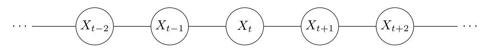
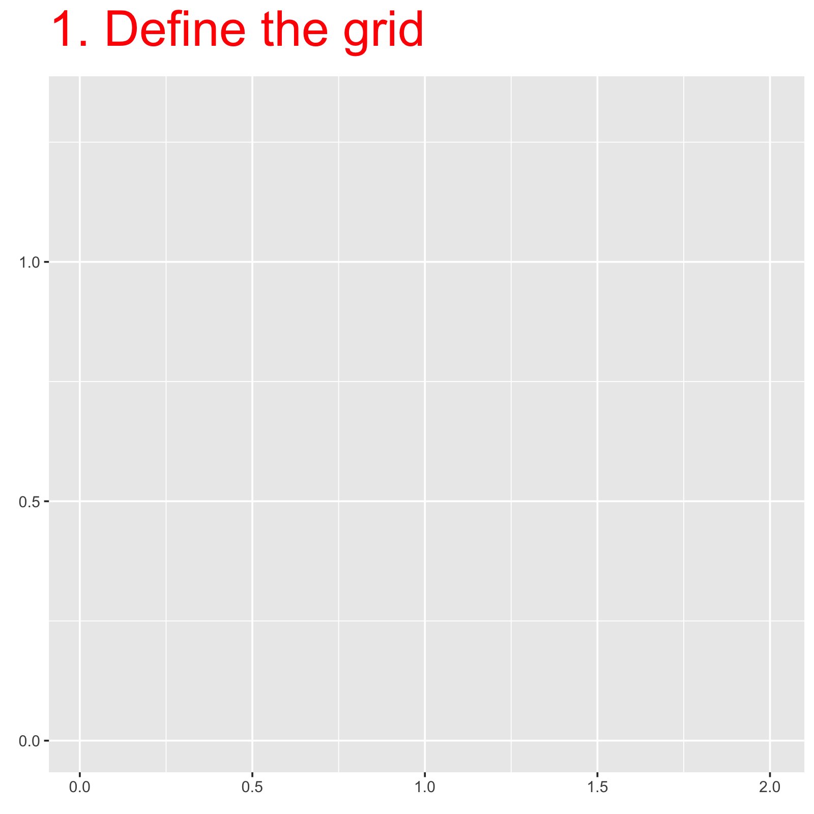

```{r setup}
# #| include: false

knitr::opts_chunk$set(echo = FALSE,
                      message=FALSE,
                      warning=FALSE,
                      strip.white=TRUE,
                      prompt=FALSE,
                      fig.align="center",
                       out.width = "60%")

library(knitr)    # For knitting document and include_graphics function
library(ggplot2)  # For plotting
library(png)
library(tidyverse)
library(INLA)
library(BAS)
library(patchwork)

```

```{r}
# code from the book
library(fields)
library(viridisLite)
library(RColorBrewer)

book.rMatern <- function(n, coords, sigma=1, range, kappa = sqrt(8*nu)/range, variance = sigma^2, nu=1) {
    m <- as.matrix(dist(coords))
    m <- exp((1-nu)*log(2) + nu*log(kappa*m)-
             lgamma(nu))*besselK(m*kappa, nu)
    diag(m) <- 1
    return(drop(crossprod(chol(variance*m),
                          matrix(rnorm(nrow(coords)*n), ncol=n))))
}

book.rspde <- function(coords, sigma=1, range, variance=sigma^2, alpha=2, kappa = sqrt(8*(alpha-1))/range, n=1, mesh, 
                  verbose=FALSE, seed, return.attributes=FALSE) {
    t0 <- Sys.time()
    theta <- c(-0.5*log(4*pi*variance*kappa^2), log(kappa))
    if (verbose) cat('theta =', theta, '\n')
    if (missing(mesh)) {
        mesh.pars <- c(0.5, 1, 0.1, 0.5, 1)*sqrt(alpha-ncol(coords)/2)/kappa 
        if (verbose) cat('mesh.pars =', mesh.pars, '\n')
        attributes <- list(
            mesh=inla.mesh.2d(,
                coords[chull(coords), ], max.edge=mesh.pars[1:2], 
                cutoff=mesh.pars[3], offset=mesh.pars[4:5]))
        if (verbose) cat('n.mesh =', attributes$mesh$n, '\n')
    }
    else attributes <- list(mesh=mesh)
    attributes$spde <- inla.spde2.matern(attributes$mesh, alpha=alpha)
    attributes$Q <- inla.spde2.precision(attributes$spde, theta=theta)
    attributes$A <- inla.mesh.project(mesh=attributes$mesh, loc=coords)$A
    if (n==1) 
        result <- drop(attributes$A%*%inla.qsample(
            Q=attributes$Q,
            constr=attributes$spde$f$extraconstr))
    t1 <- Sys.time() 
    result <- inla.qsample(n, attributes$Q, 
                           seed=ifelse(missing(seed), 0, seed), 
                           constr=attributes$spde$f$extraconstr) 
    if (nrow(result)<nrow(attributes$A)) {
        result <- rbind(result, matrix(
            NA, nrow(attributes$A)-nrow(result), ncol(result)))
        dimnames(result)[[1]] <- paste('x', 1:nrow(result), sep='')
        for (j in 1:ncol(result)) 
            result[, j] <- drop(attributes$A%*%
                                result[1:ncol(attributes$A),j])
    }
    else {
        for (j in 1:ncol(result)) 
            result[1:nrow(attributes$A), j] <-
                drop(attributes$A%*%result[,j]) 
        result <- result[1:nrow(attributes$A), ]
    }
    t2 <- Sys.time()
    attributes$cpu <- c(prep=t1-t0, sample=t2-t1, total=t2-t0)
    if (return.attributes) 
        attributes(result) <- c(attributes(result), attributes)
    return(drop(result))
}

book.mesh.dual <- function(mesh) {
    if (mesh$manifold=='R2') {
        ce <- t(sapply(1:nrow(mesh$graph$tv), function(i)
            colMeans(mesh$loc[mesh$graph$tv[i, ], 1:2])))
        library(parallel)
        pls <- mclapply(1:mesh$n, function(i) {
            p <- unique(Reduce('rbind', lapply(1:3, function(k) {
                j <- which(mesh$graph$tv[,k]==i)
                if (length(j)>0) 
                    return(rbind(ce[j, , drop=FALSE],
                                 cbind(mesh$loc[mesh$graph$tv[j, k], 1] +
                                       mesh$loc[mesh$graph$tv[j, c(2:3,1)[k]], 1], 
                                       mesh$loc[mesh$graph$tv[j, k], 2] +
                                       mesh$loc[mesh$graph$tv[j, c(2:3,1)[k]], 2])/2))
                else return(ce[j, , drop=FALSE])
            })))
            j1 <- which(mesh$segm$bnd$idx[,1]==i)
            j2 <- which(mesh$segm$bnd$idx[,2]==i)
            if ((length(j1)>0) | (length(j2)>0)) {
                p <- unique(rbind(mesh$loc[i, 1:2], p,
                                  mesh$loc[mesh$segm$bnd$idx[j1, 1], 1:2]/2 +
                                  mesh$loc[mesh$segm$bnd$idx[j1, 2], 1:2]/2, 
                                  mesh$loc[mesh$segm$bnd$idx[j2, 1], 1:2]/2 +
                                  mesh$loc[mesh$segm$bnd$idx[j2, 2], 1:2]/2))
                yy <- p[,2]-mean(p[,2])/2-mesh$loc[i, 2]/2
                xx <- p[,1]-mean(p[,1])/2-mesh$loc[i, 1]/2
            }
            else {
                yy <- p[,2]-mesh$loc[i, 2]
                xx <- p[,1]-mesh$loc[i, 1]
            }
            Polygon(p[order(atan2(yy,xx)), ])
        })
        return(SpatialPolygons(lapply(1:mesh$n, function(i)
            Polygons(list(pls[[i]]), i))))
    }
    else stop("It only works for R2!")
}

genColor <- function(n, type=c('red', 'green', 'blue'), u=NULL) {
    cbp <- list(
        red = list(c(255, 254, 252, 252, 251, 239, 203, 165, 103), 
                   c(245, 224, 187, 146, 106, 59, 24, 15, 0), 
                   c(240, 210, 161, 114, 74, 44, 29, 21, 13)), 
        green = list(c(247, 229, 199, 161, 116, 65, 35, 0, 0), 
                     c(252, 245, 233, 217, 196, 171, 139, 109, 68), 
                     c(245, 224, 192, 155, 118, 93, 69, 44, 27)), 
        blue = list(c(247, 222, 198, 158, 107, 66, 33, 8, 8), 
                    c(251, 235, 219, 202, 174, 146, 113, 81, 48), 
                    c(255, 247, 239, 225, 214, 198, 181, 156, 107)))
    if (n<2) stop("Works for 'n>2'!")
    if (is.null(u))
        u <- 0:(n-1)/(n-1)
    u0 <- 0:8/8
    i <- findInterval(u, u0, TRUE)
    k <- pmatch(match.arg(type), c('red', 'green', 'blue'))
    w1 <- 8*(u0[i+1]-u)/255; w2 <- 8*(u-u0[i])/255
    rgb(cbp[[k]][[1]][i]*w1 + cbp[[k]][[1]][i+1]*w2, 
        cbp[[k]][[2]][i]*w1 + cbp[[k]][[2]][i+1]*w2, 
        cbp[[k]][[3]][i]*w1 + cbp[[k]][[3]][i+1]*w2)
}

plot.dgTMatrix <- function(x, y, ...) {
    cl <- match.call()
    if (is.null(cl$digits))
        digits <- 2
    z <- sort(unique(round(x@x, digits)))
    nz <- length(z)
    n1 <- sum(z<0)
    n2 <- sum(z>0)
    if (is.null(cl$colors)) 
        if (any(c(n1,n2)==0)) 
            colors <- gray(0.9*(1-(z-min(z))/diff(range(z))))
        else
            colors <- c(genColor(n1, 'red', z[z<0]/min(z)),
                        rep('white', nz-n1-n2),
                        genColor(n2, 'blue', z[z>0]/max(z)))
    z.breaks <- c(z[1]-diff(z[1:2])/2,
                  z[-nz]/2 + z[-1]/2,
                  z[nz]+diff(z[nz-1:0])/2)
    x@x <- round(x@x, digits)
    image(x, at=z.breaks, col.regions=colors, ...)
}

book.plot.field <- function(field, mesh, projector, xlim, ylim, 
			    dims=c(300,300), poly, asp = 1, 
			    axes = FALSE, xlab = '', ylab = '', 
			    col = book.color.c(), ...){
  ## you can supply field as a matrix vector or like a named list with 'x', 'y' and 'z' as for image
  ## when field is a vector, it will project it using projector, assuming projector will create a matrix 
  ## when mesh is supplied and projector not, projector will be created and used to project field
  if (missing(mesh)) {
    if (missing(projector)) {
      if (missing(xlim) | missing(ylim)) {
        image.plot(field, asp = asp, axes = axes, 
                   xlab = xlab, ylab = ylab, col = col, ...)
      } else {
        image.plot(field, xlim = xlim, ylim = ylim, asp = asp, 
                   axes = axes, xlab = xlab, ylab = ylab, col = col, ...)
      }
    } else {
      if (missing(xlim)) xlim <- range(projector$x)
      if (missing(ylim)) ylim <- range(projector$y)
      field.proj <- inla.mesh.project(projector, field)
      image.plot(x = projector$x, y = projector$y, z = field.proj, 
                 asp=asp, axes=axes, xlab = xlab, ylab = ylab, 
                 col=col, xlim=xlim, ylim=ylim, ...)
    }
  } else {
    if (missing(xlim)) xlim <- range(mesh$loc[,1])
    if (missing(ylim)) ylim <- range(mesh$loc[,2])
    projector <- inla.mesh.projector(mesh, xlim = xlim,
                                     ylim = ylim, dims=dims)
    field.proj <- inla.mesh.project(projector, field)
    image.plot(x = projector$x, y = projector$y, z = field.proj, 
               asp=asp, axes=axes, xlab = xlab, ylab = ylab, col=col, ...)
  }
  if (!missing(poly)) 
      plot(poly, add = TRUE, col = 'grey')
}

## Functions for barrier models

## Find the correlation of precision Q (defined on mesh) at location 
book.spatial.correlation <- function(Q, location, mesh) {
  ## The marginal standard deviations
  sd <- sqrt(diag(inla.qinv(Q)))

  ## Create a fake A matrix, to extract the closest mesh node index
  A.tmp <- inla.spde.make.A(mesh = mesh,
    loc = matrix(c(location[1], location[2]), 1, 2))
  id.node = which.max(A.tmp[1, ])

  ## Solve a matrix system to find just one column of the covariance matrix
  Inode <- rep(0, dim(Q)[1])
  Inode[id.node] <- 1
  covar.column <- solve(Q, Inode)
  corr <- drop(matrix(covar.column)) / (sd * sd[id.node])
  return(corr)
}

## Continuous and discrete colour scales for the book
# n=8; plot(1:n, col=brewer.pal(n = n, name = "Paired"))

# Continuous
book.color.c = function(n = 201) {
  return(viridis(n))
}

# Continuous (alternative)
book.color.c2 = function(n = 201) {
  return(magma(n))
}

# Discrete from a continuous
book.color.dc = function(n = 11) {
  return(viridis(n))
}

# Discrete (cannot be interpolated)
book.color.d = function(n=4) {
  return(brewer.pal(n = n, name = "Paired"))
}

```

## Main elements of the INLA methodology

-   Latent Gaussian Models
-   Sparse matrices
-   Laplace approximations
-   ...other "technical" details for the special interested!

# Latent Gaussian Models (repetition)

## Repetition

Everything in INLA is based on so-called **latent Gaussian models**

> -   A few hyperparameters $\theta\sim\pi(\theta)$ control variances, range and so on
> -   Given these hyperparameters we have an underlying Gaussian distribution $\mathbf{u}|\theta\sim\mathcal{N}(\mathbf{0},\mathbf{Q}^{-1}(\theta))$ that we cannot directly observe
> -   Instead we make indirect observations $\mathbf{y}|\mathbf{u},\theta\sim\pi(\mathbf{y}|\mathbf{u},\theta)$ of the underlying latent Gaussian field

## Repetition

Models of this kind: $$
\begin{aligned}
\mathbf{y}|\mathbf{u},\theta &\sim \prod_i \pi(y_i|\eta_i,\theta)\\
\mathbf{\eta} & = A_1\mathbf{u}_1 + A_2\mathbf{u}_2+\dots + A_k\mathbf{u}_k\\
\mathbf{u},\theta &\sim \mathcal{N}(0,\mathbf{Q}(θ)^{−1})\\
\theta & \sim \pi(\theta)
\end{aligned}
$$

occurs in many, seemingly unrelated, statistical models.

## Examples {.smaller}

-   Generalised linear (mixed) models
-   Stochastic volatility
-   Generalised additive (mixed) models
-   Measurement error models
-   Spline smoothing
-   Semiparametric regression
-   Space-varying (semiparametric) regression models
-   Disease mapping
-   Log-Gaussian Cox-processes
-   Model-based geostatistics (\*)
-   Spatio-temporal models
-   Survival analysis
-   +++

## Main Characteristics

1.  Latent **Gaussian** model $\mathbf{u}|\theta\sim\mathcal{N}(0,\mathbf{Q}^{-1}(\theta))$
2.  The data are *conditionally independent* given the latent field
3.  The predictor is linear wrt the elements of $\mathbf{u}$[^1]
4.  The dimension of $\mathbf{u}$ can be big ($10^3-10^6$)
5.  The dimension of $\theta$ should be not too big.

[^1]: we will see that this can be partly relaxed :smiley:

. . .

::: {style="font-size:44px"}
In this talk we will focus on the characteristics of $\mathbf{u}|\theta$
:::

## The big n problem!

For many interesting applications it is necessary to solve large problems.

> -   With large problems we think of models where the size $n$ of the latent field $\mathbf{u}$ is between 100 to 100, 000. This includes fixed effects, spatial effects and so on.

> -   Computations with models of this size are cumbersome!

> -   The solution in the *INLA world* are **Gaussian Markov random fields (GMRFs)**!

# Gaussian Markov random fields

## The Gaussian distribution

A Gaussian distribution $\mathbf{u}\sim\mathcal{N}(0,\Sigma)$ is controlled by:

— The mean vector $\mu$, which we have set equal to 0. This is the centre of the distribution

— The matrix $\Sigma$ describes all pairwise covariances $\Sigma_{ij} = \text{Cov}(u_i, u_j)$

Formally $$
\pi(\mathbf{u}) = \frac{1}{2\pi|\Sigma|^{1/2}}\exp\left\{-\frac{1}{2}\mathbf{u}^T\Sigma^{-1}\mathbf{u}\right\}
$$

## The Gaussian distribution

| Advantages :smile::+1: | Disadvantages :pensive::-1: |
|----------------------------------------|--------------------------------|
| **mostly theoretical** | **mostly computational** |
| Analytically tractable. | $\Sigma$ usually is large and **dense** |
| We have a good understanding of its properties. | Computations scale as $\mathcal{O}(n^3)$ |
| Basically, it’s easy to do the theory | Not feasible for large problems |

. . .

We need to reduce the computational burden !

## Sparse matrices

> A matrix $\mathbf{Q}$ is called *sparse* if most of its elements are zero.

$$
\mathbf{Q} = \begin{bmatrix}
1 & 0 & 0 & 0\\
0& 2& 0 & 0\\
0& 0& -1 & 0\\
0& 1& 0 & 0.4\\
\end{bmatrix}
$$

— There exist very efficient numerical algorithms to deal with sparse matrices:

— In order to solve large problems we need to exploit some property to make the computations feasible

. . .

::: {style="font-size:44px"}
Which matrix should be sparse in a Gaussian field?
:::

## Two possible options

$$
\mathcal{u}\sim\mathcal{N}(0,\Sigma)
$$

1.  Force the *covariance* matrix $\Sigma$ to be sparse

2.  Force the *precision* matrix $\Sigma^{-1}$ to be sparse

## Two possible options {auto-animate="true"}

$$
\mathcal{u}\sim\mathcal{N}(0,\Sigma)
$$

1.  Force the *covariance* matrix $\Sigma$ to be sparse

    -   $\Sigma_{ij} = \text{Cov}(u_i, u_j)$ : Covariance between $u_i$ and $u_j$
    -   $\Sigma_{ij} = 0$ $\longrightarrow$ $u_i$ and $u_j$ are *independent*
    -   A sparse covariance matrix implies that many elements of $\mathbf{u}$ are mutually independent.....is this desirable?

2.  Force the *precision* matrix $\mathbf{Q} = \Sigma^{-1}$ to be sparse

## Two possible options {auto-animate="true"}

$$
\mathcal{u}\sim\mathcal{N}(0,\Sigma)
$$

1.  Force the *covariance* matrix $\Sigma$ to be sparse

    -   $\Sigma_{ij} = \text{Cov}(u_i, u_j)$ : Covariance between $u_i$ and $u_j$
    -   $\Sigma_{ij} = 0$ $\longrightarrow$ $u_i$ and $u_j$ are *independent*
    -   A sparse covariance matrix implies that many elements of $\mathbf{u}$ are mutually independent.....is this desirable?

2.  Force the *precision* matrix $\mathbf{Q} = \Sigma^{-1}$ to be sparse

    -   What does $Q_{ij}$ represents?
    -   What does a sparse precision matrix implies?

## Example: The AR1 proces

**Definition**

$$
\begin{aligned}
\mathbf{i=1}&:  u_1 \sim\mathcal{N}(0, \frac{1}{1-\phi^2})\\
\mathbf{i=2,\dots,T}&:  u_i  = \phi\  u_{i-1} +\epsilon_i,\ \epsilon_i\sim\mathcal{N}(0,1)
\end{aligned}
$$

-   Very common to model dependence in time
-   The *joint* distribution of $u_1,u_2,\dots,u_N$ is Gaussian
-   How do covariance and precision matrices look?

## Covariance and Precision Matrix for AR1 {auto-animate="true"}

::::: columns
::: {.column .smaller width="60%"}
**Covariance Matrix**

$$
\Sigma = \frac{1}{1-\phi^2}  \begin{bmatrix}
1& \phi & \phi^2  & \dots& \phi^N \\
\phi & 1& \phi  & \dots& \phi^{N-1} \\
\phi^2 & \phi & 1 & \dots& \phi^{N-2} \\
\dots& \dots& \dots& \dots& \dots& \\
\phi^{N} & \phi^{N-1}& \phi^{N-2}  & \dots& 1\\
\end{bmatrix}
$$

-   This is a *dense* matrix.

-   All elements of the $\mathbf{u}$ vector are *dependent*.
:::

::: {.column width="40%"}
```{r, echo = F, eval = T}
phi = 0.8
x = 0:15
cx = (1-phi^2)^(-1)*phi^x

data.frame(lag = x, cov = cx) %>%
  ggplot() + geom_point(aes(lag, cov)) +
  ggtitle(expression("Covariance between "~u[i]~u[i+h])) +
  xlab("h") + ylab("") + ylim(0,(1-phi^2)^(-1)) +
   theme(title = element_text(size = 18),
        axis.text.x = element_text(size = 16),
        axis.text.y = element_text(size = 16)) 
```
:::
:::::

## Covariance and Precision Matrix for AR1 {auto-animate="true"}

**Precision Matrix**

$$
\mathbf{Q} = \Sigma^{-1} =  \begin{bmatrix}
1& -\phi & 0  & 0 &\dots& 0 \\
-\phi & 1 + \phi^2& -\phi  & 0 & \dots& 0 \\
0 & -\phi & 1-\phi^2 &-\phi &  \dots& 0 \\
0 & 0 & -\phi &1-\phi^2 & \dots & \dots \\
\dots& \dots& \dots& \dots& \dots& \dots& \\
0 &0 & 0 & \dots  & -\phi& 1\\
\end{bmatrix}
$$

-   This is a tridiagonal matrix, it is *sparse*

-   The tridiagonal form of $\mathbf{Q}$ can be exploited for quick calculations.

. . .

What is the key property of this example that causes $\mathbf{Q}$ to be sparse?

## Conditional independence

The key lies in the **full conditionals**

$$
u_t|\mathbf{u}_{-t}\sim\mathcal{N}\left(\frac{\phi}{1-\phi^2}(x_{t-1}+x_{t+1}), \frac{1}{1+\phi^2}\right)
$$

-   Each timepoint is only **conditionally dependent** on the two closest timepoints

-   It is useful to represent the conditional independence structure through a graph



## Conditional independence and the precision matrix

::: {style="font-size:54px"}
> **Theorem**: $u_i\perp u_j|\mathbf{u}_{-ij}\Longleftrightarrow Q{ij} =0$
:::

This is the key property! :smiley:

## (Informal) definition of a GMRF {.smaller}

::: {style="font-size:34px"}
> A **GMRF** is a Gaussian distribution where the non-zero elements of the precision matrix are defined by the graph structure.
:::

. . .

In the previous example the precision matrix is tridiagonal since each variable is connected only to its predecessor and successor.

$$
\mathbf{Q} = \Sigma^{-1} =  \begin{bmatrix}
1& -\phi & 0  & 0 &\dots& 0 \\
-\phi & 1 + \phi^2& -\phi  & 0 & \dots& 0 \\
0 & -\phi & 1-\phi^2 &-\phi &  \dots& 0 \\
0 & 0 & -\phi &1-\phi^2 & \dots & \dots \\
\dots& \dots& \dots& \dots& \dots& \dots& \\
0 &0 & 0 & \dots  & -\phi& 1\\
\end{bmatrix}
$$


## GMRF and INLA

-   Every component of the *latent Gaussian* field $\mathbf{u}$ in an INLA model is always a GMRF!!
-   We will see how the idea of GMRF expands also for continuously indexed processes (SPDE approach)

## What do we need to be able to compute?

-   We need to compute determinants of large, sparse matrices. This is needed for likelihood calculations.

-   We need to compute square roots of large, sparse matrices. This is needed for likelihood calculations and simulations.

. . .

**Technically:**

-   In the end our computations come down to the Cholesky decomposition, $\mathbf{Q} = \mathbf{LL}^T$
-   After $\mathbf{L}$ is available, things are fast
-   The limiting factor is how quickly the Cholesky factorization can be done

## What is the gain?

-   Temporal structure uses $\mathcal{O}(n)$ operations
-   Spatial structure uses $\mathcal{O}(n^{3/2})$ operations
-   Spatio-temporal structure uses $\mathcal{O}(n^{2})$ operations

Compare this with $\mathcal{O}(n^{3})$ operations in the general case.

```{r}
n = seq(1,1000,10)
p0 = data.frame(size = n, 
           temporal = n,
           spatial = n^(3/2),
           space_time = n^2,
           dense = n^3) %>%
    pivot_longer(-size, names_to = "structure") %>%

  ggplot() + geom_line(aes(size, value, group = structure, color = structure))+  ggtitle("natural scale")+
    ylab("n. of operations")

p1 = data.frame(size = n, 
           temporal = n,
           spatial = n^(3/2),
           space_time = n^2,
           dense = n^3) %>%
    pivot_longer(-size, names_to = "structure") %>%
  ggplot() + geom_line(aes(size, value, group = structure, color = structure))+ scale_y_log10() + ggtitle("log-scale") +
  ylab("")
p0 + p1 +plot_layout(guides = "collect")
```

## Summary

Gaussian Markov Random Fields (GMRF):

-   Give faster computations, both in INLA and in MCMC schemes (thanks to sparse precision matrices)
-   Keep the analytical tractability of the Gaussian distribution
-   Allow modelling through conditional distributions
-   Naturally arises from the SPDE approach (that we will talk about .....)

## Formal definition of a GMRF

> **Definition**
>
> A random variable $\mathbf{u}$ is said to be a Gaussian Markov random field (GMRF) with respect to the graph $\mathcal{G}$, with vertices $\{1, 2,\dots , n\}$ and edges $\mathcal{E}$, with mean $\mu$ and precision matrix $\mathbf{Q}$ if its probability distribution is given by $$
> \pi(\mathbf{u}) = \frac{|\mathbf{Q}|^{1/2}}{(2\pi)^{n/2}}\exp\left\{ -\frac{1}{2}(\mathbf{u}-\mu)^T\mathbf{Q}(\mathbf{u}-\mu)\right\}
> $$ and $Q_{ij} \neq 0\Longleftrightarrow \{i,j\}\in\mathcal{E}$

# How INLA works

## The INLA recipe

-   Numerical integration schemes
-   The GMRF-Approximation
-   The Laplace approximation
-   ...many many many "technical" details

## Hierarchical GMRF {.smaller auto-animate="true"}

-   $\mathbf{y}|\mathbf{u},\theta$, Observation model (likelihood)
-   $\mathbf{u}|\theta$, Gaussian random field
-   $\theta$ Hyperparameters

## Hierarchical GMRF {.smaller auto-animate="true"}

-   $\mathbf{y}|\mathbf{u},\theta$, Observation model (likelihood)
-   $\mathbf{u}|\theta$, Gaussian random field
-   $\theta$ Hyperparameters

### Extra requirements

1.  The latent field $\mathbf{u}$ is a GMRF $$
     \pi(\mathbf{u}|\theta)\propto\exp\left\{-\frac{1}{2}\mathbf{u}^T\mathbf{Q}\mathbf{u}\right\}
     $$

    -   The precision matrix $\mathbf{Q}$ is sparse.

## Hierarchical GMRF {.smaller auto-animate="true"}

-   $\mathbf{y}|\mathbf{u},\theta$, Observation model (likelihood)
-   $\mathbf{u}|\theta$, Gaussian random field
-   $\theta$ Hyperparameters

### Extra requirements

1.  The latent field $x$ is a GMRF $\pi(\mathbf{u}|\theta)\propto\exp\left\{-\frac{1}{2}\mathbf{u}^T\mathbf{Q}\mathbf{u}\right\}$

2.  We can factorize the likelihood as: $\pi(\mathbf{y}|\mathbf{u},\theta) = \prod_i\pi(y_i|\eta_i,\theta)$

    -   Data are conditional independent give $\mathbf{u}$ and $\theta$
    -   Each data point depends on only 1 element of the latent field: the *predictor* $\eta_i$
    -   $\eta$ is a *linear* combination of other elements of $\mathbf{u}$: $\eta = \mathbf{A}^T\mathbf{u}$

## Hierarchical GMRF {.smaller auto-animate="true"}

-   $\mathbf{y}|\mathbf{u},\theta$, Observation model (likelihood)
-   $\mathbf{u}|\theta$, Gaussian random field
-   $\theta$ Hyperparameters

### Extra requirements

1.  The latent field $\mathbf{u}$ is a GMRF $\pi(\mathbf{u}|\theta)\propto\exp\left\{-\frac{1}{2}\mathbf{u}^T\mathbf{Q}\mathbf{u}\right\}$

2.  We can factorize the likelihood as: $\pi(\mathbf{y}|\mathbf{u},\theta) = \prod_i\pi(y_i|\eta_i,\theta)$

3.  The vector of hyperparameters $\theta$ is low dimensional.

## Inference

**Main Inferential Goal**:

\begin{aligned}
\overbrace{\pi(\mathbf{u}, {\theta}\mid\mathbf{y})}^{{\text{Posterior}}} &\propto \overbrace{\pi({\theta}) \pi(\mathbf{u}\mid{\theta})}^{{\text{Prior}}} \overbrace{\prod_{i}\pi(y_i \mid \eta_i, {\theta})}^{{\text{Likelihood}}}
\end{aligned}

::: incremental
-   The posterior distribution is, in general, not available in closed form...
-   ..what to do then?
:::

## INLA strategy in short

**Assumption**

We are mainly interested in *posterior margianals* $\pi(u_i|\mathbf{y})$ and $\pi(\theta_j|\mathbf{y})$

**Strategy**

-   We use numerical integration in a smart way
-   We approximate what we do not know analitically exploiting the Gaussian structure of $\mathbf{u}|\theta$

## Numerical Integration {auto-animate="true"}

We want to compute $\pi(u_i|\mathbf{y})$

. . .

::::: columns
::: {.column width="70%"}
**Hard way** :-1:

$$
\pi(u_i|\mathbf{y}) = \int\pi(\mathbf{u}|\theta)\ d\mathbf{u}_{-i}
$$

-   This is a hard integral as $\mathbf{u}$ can be very high dimentional!!
:::

::: {.column width="30%"}
:::
:::::

## Numerical Integration {auto-animate="true"}

We want to compute $\pi(u_i|\mathbf{y})$

. . .

::::: columns
::: {.column width="50%"}
**Hard way** :-1:

$$
\pi(u_i|\mathbf{y}) = \int\pi(\mathbf{u}|\mathbf{y})\ d\mathbf{u}_{-i}
$$

-   This is a hard integral as $\mathbf{u}$ can be very high dimentional!!
:::

::: {.column width="50%"}
**Easier way** :+1:

$$
\pi(u_i|\mathbf{y}) = \int\pi(u_i|\theta, \mathbf{y})\pi(\theta|\mathbf{y)}\ d\theta
$$

-   $\theta$ is a smaller dimensional vector, easier to integrate
-   **BUT** we need to approximate both $\pi(\theta|\mathbf{y})$ and $\pi(u_i|\theta, \mathbf{y})$
:::
:::::

## Approximating the posterior for the hyperparameters {auto-animate="true"}

We want to build an approximation to $\pi(\theta|\mathbf{y})$

$$
\pi(\mathbf{\theta} \mid \mathbf{y}) =  \frac{
           \pi(\mathbf{u}, \mathbf{
           \theta
}\mid \mathbf{y})}
      {\pi(\mathbf{u} \mid \mathbf{y},
            \mathbf{\theta})} \: \Bigg|_{\text{This is just the Bayes theorem! It is valid for  any value of } \mathbf{u}}
$$

## Approximating the posterior for the hyperparameters {auto-animate="true"}

We want to build an approximation to $\pi(\theta|\mathbf{y})$

\begin{aligned}
\pi(\mathbf{\theta} \mid \mathbf{y}) & =  \frac{
           \pi(\mathbf{u}, \mathbf{
           \theta
}\mid \mathbf{y})}
      {\pi(\mathbf{u} \mid \mathbf{y},
            \mathbf{\theta})} \\
            & \propto \frac{
            \overbrace{\pi( \mathbf{y}\mid \mathbf{u},\mathbf{\theta})\  \pi(\mathbf{\theta})}^{\text{Non-Gaussian, KNOWN}}  \overbrace{\pi( \mathbf{u}\mid \mathbf{\theta})}^{\text{ Gaussian, KNOWN}}  }
            {\underbrace{\pi(\mathbf{u} \mid \mathbf{y},
            \mathbf{\theta})}_{\text{Non-Gaussian,UNKNOWN}}}
\end{aligned}

. . .

-   We approximate $\pi(\mathbf{u} \mid \mathbf{y},\mathbf{\theta})$ with a **Gaussian** distribution $\pi_G(\mathbf{u} \mid \mathbf{y},\mathbf{\theta})$

## The GMRF Approximation {.smaller auto-animate="true"}

$$
\begin{aligned}
\pi(\mathbf{u}\mid {\theta},\mathbf{y}) & \propto \pi(\mathbf{u}\mid {\theta}) \pi(\mathbf{y}|\mathbf{u},\theta) \\
& \propto \exp\left\{-\frac{1}{2}\mathbf{u}^T\mathbf{Q}\mathbf{u} + \sum \log \pi(y_i|\eta_i,\theta)\right\}\\
\end{aligned}
$$

## The GMRF Approximation {.smaller auto-animate="true"}

$$
\begin{aligned}
\pi(\mathbf{u}\mid {\theta},\mathbf{y}) & \propto \pi(\mathbf{u}\mid {\theta}) \pi(\mathbf{y}|\mathbf{u},\theta) \\
& \propto \exp\left\{-\frac{1}{2}\mathbf{u}^T\mathbf{Q}\mathbf{u} + \sum \log \pi(y_i|\eta_i,\theta)\right\}\\
\end{aligned}
$$

$$
\begin{aligned}
& \approx \exp\left\{-\frac{1}{2}\mathbf{u}^T\mathbf{Q}\mathbf{u} + \sum (b_i\eta_i - \frac{1}{2}c_i\eta_i^2)\right\}
\end{aligned}
$$

Recall $$
\begin{aligned}
        f(x) \approx f(x_0) + f'(x_0)(x-x_0)+ \frac{1}{2} f''(x_0)(x-x_0)^2
        = a+ bx - \frac{1}{2}cx^2
\end{aligned}
$$ with

$$
\begin{aligned}
b &=f'(x_0) - f''(x_0)x_0\\
c &= -f''(x_0)
\end{aligned}
$$.

## The GMRF Approximation {.smaller auto-animate="true"}

$$
\begin{aligned}
\pi(\mathbf{u}\mid {\theta},\mathbf{y}) & \propto \pi(\mathbf{u}\mid {\theta}) \pi(\mathbf{y}|\mathbf{u},\theta) \\
& \propto \exp\left\{-\frac{1}{2}\mathbf{u}^T\mathbf{Q}\mathbf{u} + \sum \log \pi(y_i|\eta_i,\theta)\right\}\\
& = \exp \left\{ -\frac{1}{2} \mathbf{u}^T\tilde{\mathbf{Q}}  \mathbf{u} + \tilde{\mathbf{b}}\mathbf{u}\right\}
\end{aligned}
$$ Which means that we approximate $\pi(\mathbf{u}\mid {\theta},\mathbf{y})$ with

$$
\mathcal{N}(\tilde{\mathbf{Q}}^{-1}\tilde{\mathbf{b}},\tilde{\mathbf{Q}}^{-1})\  \text{ with   }\ \tilde{\mathbf{Q}} = \mathbf{Q} +\begin{bmatrix}
\text{diag}(\mathbf{c}) & 0\\
0& 0
\end{bmatrix}\qquad \tilde{\mathbf{b}} = [\mathbf{b}\ 0]^T
$$

<!-- . . . -->

<!-- ::: {.r-stack .larger style="font-size: 1.5em;"} -->

<!-- **Q**: Why do we want $\mathbf{\eta}$ to be part of the $\mathbf{u}$ -->

<!-- vector? -->

<!-- ::: -->

<!--  - It creates a general structure equal for all models -->

<!--  - It allows to easily do inference for $\eta$ -->

## The GMFR approximation - One dimensional example {.smaller}

::::: columns
::: {.column width="40%"}
Assume $$
\begin{aligned}
  y|\lambda \sim\text{Poisson}(\lambda)  & \text{ Likelihood}\\
  \eta = \log(\lambda)  & \text{ Predictor}\\
  \mathbf{u}  = \eta & \text{ Latent field }\\
  x\sim\mathcal{N}(0,1) & \text{ Latent Model}
\end{aligned}
$$ we have that

$$
\begin{aligned}
  \pi(x|y) & \propto\pi(y|x)\pi(x)\\
  & \propto\exp\{ -\frac{1}{2}x^2+
  \underbrace{xy-\exp(x)}_{\text{non-gaussian part}}
  \}
\end{aligned}
$$
:::

::: {.column width="60%"}
```{r}
#source("Code/GMRF_approx.R")
library(patchwork)

xi <- seq(-1.5,4,0.001)
y <- 3
delta <- 0.005
eta <- 0
approx <- function(xi, y, eta, delta){
  res <- dnorm(xi,eta, sqrt(1/delta))*dpois(y, exp(xi))
  return(res)
}
nominator_approx <- integrate(approx, -Inf, Inf, y=y, eta=eta,delta=delta)$value

# full conditional
fc <- function(xi, y, eta, delta){
  res <- exp(-(delta/2) * (xi - eta)^2 + y*xi - exp(xi))
  norm <-sqrt(delta)/(sqrt(2*pi) *factorial(y))
  #norm <- 1
  return((res *norm))
} 
nominator <- integrate(fc, -Inf, Inf, y=y, eta=eta,delta=delta)$value

# first derivative of the full conditional
f_I <- function(xi, y, eta, delta){
    res <- -delta*(xi-eta) + y - exp(xi)
    return(res)
}

# second derivative of the full conditional
f_II <- function(xi, y, eta, delta){
  res <- -delta - exp(xi)
  return(res)
}

GMRF_approx <- function(xi, xi_0, y, eta, delta){
  a <- fc(xi_0, y, eta, delta) - f_I(xi_0, y, eta, delta)*xi_0 + 0.5*f_II(xi_0, y, eta, delta)*xi_0^2
  b <- f_I(xi_0, y, eta, delta) - f_II(xi_0, y, eta, delta)*xi_0
  c <- -f_II(xi_0, y, eta, delta)
  res <- exp(-1/2 * c* xi^2 + b*xi)
  #norm <- sqrt(delta)/(factorial(y) * sqrt(2*pi))
  norm <- 1
  return(list(res=res*norm, a=a, b=b, c=c))
}

Taylor_approx <- function(xi, xi_0, y, eta, delta){
  res <- fc(xi_0, y, eta, delta) + f_I(xi_0, y, eta, delta)*(xi-xi_0) + 0.5*f_II(xi_0, y, eta, delta)*(xi-xi_0)^2
  #norm <- sqrt(delta)/(factorial(y) * sqrt(2*pi))
  norm <- 1
  return(exp(res)*norm)
}


df = data.frame(x = xi,
                  true = fc(xi, y, eta,delta)/nominator,
                  app1  = NA,
                  app2 = NA,
                  app3 = NA,
                  app4 = NA
                  )
mode =  xi[which.max(fc(xi, y, eta,delta)/nominator)]
xi_0 = c(0,0.5,1.5, mode)

exp.points = data.frame(mode =  rep(mode,4),
                          exp.point = xi_0)

for(i in 1:4)
  {
    gmrf <- GMRF_approx(xi, xi_0[i], y, eta, delta)
    df[,i+2] = dnorm(xi, gmrf$b/gmrf$c, sqrt(1/gmrf$c))
  }

p1 = ggplot() + geom_line(data  = df, aes(x,true))  +
   geom_line(data = df, aes(x, app1), color = "red") +
   xlab("") + ylab("") + ggtitle(paste("Expansion around", xi_0[1])) +
  geom_point(aes(x=exp.points[1,1], y=0), size = 2) +
   geom_point(aes(x=exp.points[1,2], y=0), color = "red", size = 2)
p2 = ggplot() + geom_line(data  = df, aes(x,true))  +
   geom_line(data = df, aes(x, app2), color = "red") +
   xlab("") + ylab("") + ggtitle(paste("Expansion around", xi_0[2])) +
  geom_point(aes(x=exp.points[2,1], y=0), size = 2) +
   geom_point(aes(x=exp.points[2,2], y=0), color = "red", size = 2)
p3 = ggplot() + geom_line(data  = df, aes(x,true))  +
   geom_line(data = df, aes(x, app3), color = "red") +
   xlab("") + ylab("") + ggtitle(paste("Expansion around", xi_0[3])) +
  geom_point(aes(x=exp.points[3,1], y=0), size = 2) +
   geom_point(aes(x=exp.points[3,2], y=0), color = "red", size = 2)
p4 = ggplot() + geom_line(data  = df, aes(x,true))  +
   geom_line(data = df, aes(x, app4), color = "red") +
   xlab("") + ylab("") + ggtitle(paste("Expansion around the mode")) +
  geom_point(aes(x=exp.points[4,1], y=0), size = 2) +
   geom_point(aes(x=exp.points[4,2], y=0), color = "red", size = 2)

p1+p2+p3+p4
```
:::
:::::

## The GMFR approximation

-   :smile: Easy to compute
-   :smile: Exact for Gaussian likelihood
-   :smile: Good when you have little or a lot of data
-   :smile: inherits the same sparseness of $\mathbf{u}$
-   :worried: No skewness

## The Laplace Approximation {auto-animate="true"}

::::: columns
::: {.column .smaller width="60%"}
$$
\begin{aligned}
\pi(\mathbf{\theta} \mid  \mathbf{y})  & \propto \frac{
            \pi( \mathbf{y}\mid \mathbf{u},\mathbf{\theta})\  \pi(\mathbf{\theta})  \pi( \mathbf{u}\mid \mathbf{\theta})  }
            {\pi(\mathbf{u} \mid \mathbf{y},
            \mathbf{\theta})}\\
            & \approx \frac{
            \pi( \mathbf{y}\mid \mathbf{u},\mathbf{\theta})\  \pi(\mathbf{\theta})  \pi( \mathbf{u}\mid \mathbf{\theta})  }
            {\pi_G(\mathbf{u} \mid \mathbf{y},
            \mathbf{\theta})}  \: \Bigg|_{\mathbf{u} = \mathbf{u}^\star(\mathbf{\theta})}
\end{aligned}
$$

If $\theta$ is **low dimension** we can actually compute this!
:::

::: {.column width="40%"}
```{r, echo = F, }


```
:::
:::::

This is the Laplace approximation to $\pi(\theta|\mathbf{y})$ !

## The INLA scheme

1.  Approximate $\pi(\theta|\mathbf{y})$ :white_check_mark:
2.  Approximate $\pi(u_i|\theta,\mathbf{y})$
3.  Use numerical integration to compute $\pi(u_i|\mathbf{y})$ :white_check_mark:

## Approximating the posterior for the latent field.

-   Now we have an aproximation for $\pi(\theta|\mathbf{y})$

-   We need an approximation for $\pi(u_i|\theta,\mathbf{y})$

-   This is more difficult... $\mathbf{u}$ is large!! Anything we do we have to do it many times!

. . .

Can we use the marginal from $\pi_G(\mathbf{u}|\theta, \mathbf{y})$ ?

## ...unfortunately it is **not** accurate enough!

:::::: columns
:::: {.column width="60%"}
{fig-align="center" width="100%" height="70%"}

::: {style="font-size: 0.6em"}
From Rue and Martino 2007
:::
::::

::: {.column width="40%"}
Notes:

-   Results are quite accurate in general
-   There can be errors in the location and/or errors due to the lack of skewness...
:::
::::::

## INLA and Variational Bayes {.smaller}

-   Variational Bayes techniques are used to improve the mean of the GMRF approximation $\pi_G(\mathbf{u}|\theta, \mathbf{y})$
-   From this improved GMRF approximation we can compute the marginals $\pi_G^*(u_i|\theta,\mathbf{y})$ that can then be used to numerically compute: $$
    \tilde{\pi}(u_i|\mathbf{y}) = \sum_k\pi_G^*(u_i|\theta, \mathbf{y})\tilde{\pi}(\theta|\mathbf{y)}\ w_k
    $$

. . .

**NOTE:**

-   We know the *precision matrix* $\mathbf{Q}$ of the GRMF approximation $\pi_G^*(\mathbf{u}|\theta, \mathbf{y})$
-   Efficient algoriths to compute the marginal variance are used.

## INLA posterior sampling

Although INLA mainly computes *posterior marginals*

-   $\pi(\theta|\mathbf{y})$
-   $\pi(u_i|\mathbf{y})$

INLA allowes to sample from the approximate posterior $\pi(\mathbf{u}|\mathbf{y})$

This is important is one is interested in the posterior of *functions* of one or more parameters.

## Take home messages!

-   The INLA methodology heavily relies on *sparse matrices* !
-   GMRF are the key tool in INLA-friendly models
-   INLA uses numerical approximation and numerical integration to provide efficient and precise approximations to posterior marginals

But ultimately....

. . .

You do not need to deeply understand all of this if you want to use `inlabru` to solve your (statistical) problems :smile:

## Good news!

Recall... we have computationally efficient and flexible methodology...

-   we can fit more (realistically) complex models...
-   e.g. spatial and spatio-temporal models (to geo-referenced data, point pattern data, aerial data, spatio-temporal data...)

. . .

Using **INLA + SPDE approach** we can:

-   fit complex models quickly
-   flexibly fit joint models of more than one response variable
-   model on complex domains, (e.g. the sphere = the earth)
-   observation areas with barriers (islands, archipelagos...)

{fig-align="center" width="70%" height="90%"}

## How to use the INLA approach {.smaller}

The INLA methodology is implemented in two R packages: `R-INLA` and `inlabru`.

Why do we (strongly) recommend `inlabru`:

. . .

-   wrapper around `R-INLA` + extra functionality.

-   much easier to fit spatial models

-   full support for `sf` and `terra` libraries

-   makes fitting of *tricky* models (e.g. multi-likelihood models, spatial point processes) less fiddly than `R-INLA`

-   takes observation process into account (e.g. for distance sampling, plot sampling); more on this later

-   allows for non-linear predictors defined by general `R` expressions (this is done by linearizing and running the INLA approximation several times...)
